# The OMG Workflow — Flowcharts

A descriptive map of what the instruments in `opencode/` actually do, drawn from
their current text.

**This document is derived, not authoritative.** The instruments are the source of
truth. If a diagram and an instrument disagree, the instrument is right and this
file is stale. It is a reading aid and a review surface — not a spec, and nothing
should be built from it.

## Conventions used in every diagram

| Shape | Meaning |
|---|---|
| `[rectangle]` | An action an agent or script performs. It may branch on its own mechanical outcome — succeeded, failed, found something |
| `{diamond}` | A judgment the agent makes, or a condition it reads off the graph |
| `{{hexagon}}` | A human gate — the process pauses for a person |
| `([stadium])` | A terminal state |

**Dependency edges are always stated as "X waits on Y."** This matters: `bd dep add
<blocked> <blocker>` puts the *waiting* bead first, and getting the direction
backwards is the single most common wiring error in these instruments.

---

## 1. The lifecycle, end to end

Four largely independent processes. Only the middle two are the epic loop.

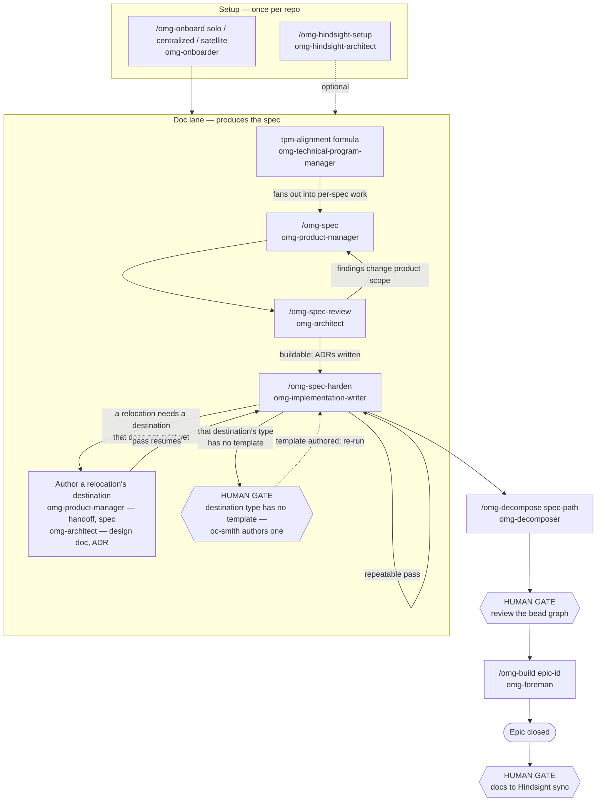

Two things worth noticing here:

- **Decomposition is handed a spec, not an epic.** `/omg-spec` explicitly creates
  no bead. The epic is minted at decomposition, once the spec and its ADRs are settled.
- **Nothing reaches durable memory automatically.** The docs→Hindsight sync is a
  human-invoked command, and a document ships only if it carries a `hindsight`
  frontmatter block. Everything else stays Git-only.

---

## 2. Plan phase — `/omg-decompose`

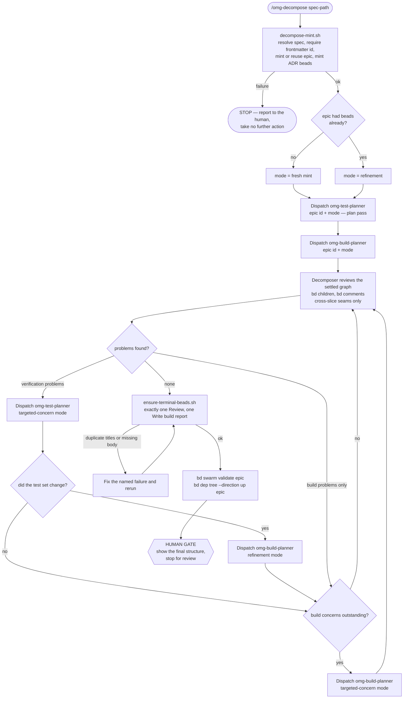

**The four concerns the decomposer hunts** — note that two of them look for *too
much* verification, which is the change this repo shipped in the verification-economy
work:

1. A spec obligation with an implementation bead that no test, gate, or review
   obligation covers, and no recorded no-verification decision explains.
2. A test bead that blocks no implementation bead.
3. Verification planned out of proportion to what it protects.
4. Verification whose mechanism does not fit its artifact.

**The re-review loop has no bound.** It runs until a review pass finds nothing.

---

## 3. The confidence planner's four outcomes

This is the vocabulary the planner reasons in. It is also where the workflow's
sharpest current gap lives, so the diagram traces each outcome all the way to
whatever actually discharges it.

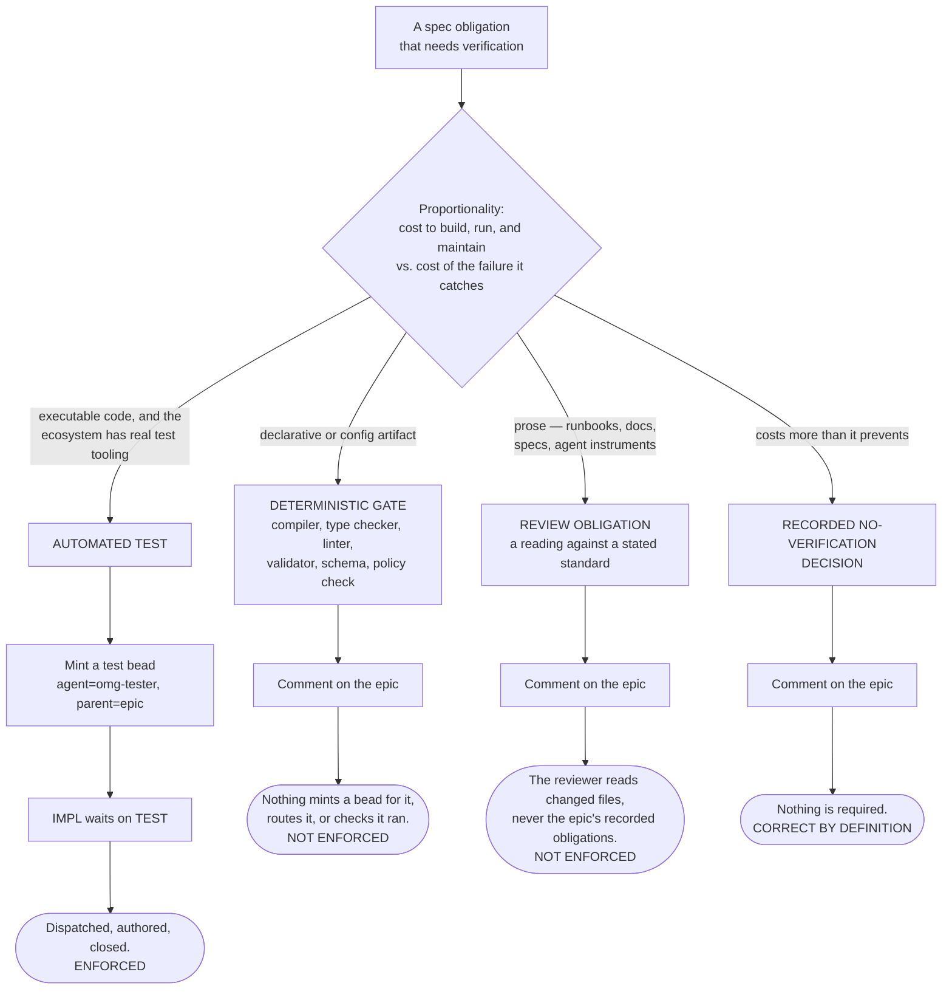

Hard rules bounding the top of this diagram:

- An automated test may be planned **only for executable code**, and **only** with
  the test framework and runner the language community already uses. The workflow
  never invents a testing methodology, harness, executor, or assertion framework.
- Prose never gets an automated test of its meaning, **including tests over its
  embedded code fences**. If a prose procedure's correctness is load-bearing enough
  to warrant executable verification, that is a signal the procedure should be a
  script — a design finding to raise, not a reason to test the prose.

See section 12, *What these diagrams expose*, for why the two "NOT ENFORCED"
outcomes are a live problem rather than a cosmetic one.

---

## 4. Canonical bead topology

The shape every epic converges on, before findings perturb it.

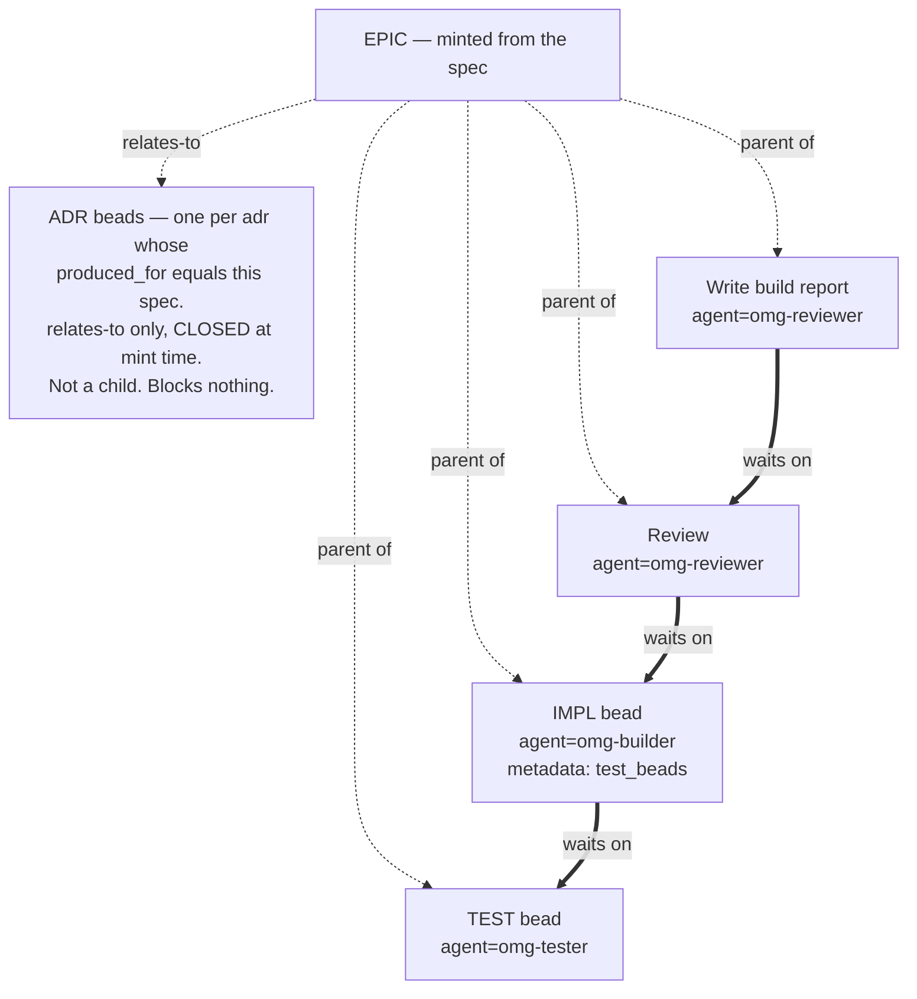

- Solid double arrows are dependency edges; dotted arrows are parentage or a
  non-blocking `relates-to` link.
- **Review waits on every non-terminal child.** Report waits on Review. Nothing
  waits on Report.
- ADR beads are a deliberate exception: they are minted `relates-to` the epic and
  **closed immediately** — "a recorded ADR is a decided decision, not open work" — so
  they never enter the ready queue and never block anything. They exist to carry the
  decision and its `hindsight` state, not to be worked.
- Test beads that touch the same files are serialized: the later waits on the earlier.
- A behavior with no planned test gets no `test_beads` stamp on its implementation
  bead, and the builder falls back to the description plus the review bead's
  full-suite run.
- **A child bead blocks its epic regardless of wiring.** This is why non-blocking
  findings must never be filed as children — see section 10, *Review, findings,
  and the fix loop*.

---

## 5. Build phase — the foreman's loop

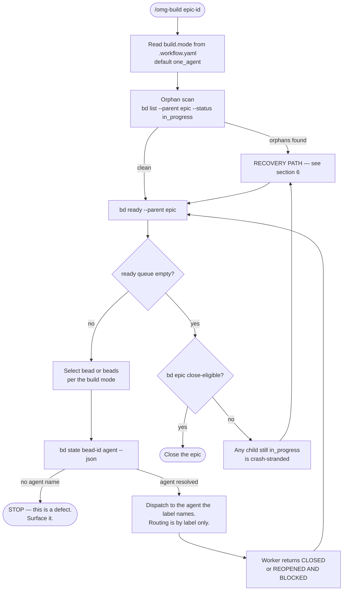

**The foreman never trusts a worker's summary as the record of truth.** After every
dispatch it re-reads `bd ready`. The queue owns ordering and blocking; the foreman
holds no state of its own.

**The loop stops only** when the epic closes, or when the next required action hits
a real blocker: a human gate, a missing `agent` label, a denied permission, or an
unrecoverable tool failure. A turn boundary is never such a blocker.

### The three build modes

| Mode | Selection | Behavior |
|---|---|---|
| `one_agent` (default) | `.workflow.yaml` `build.mode` | Sequential. Reuses one `task_id` for `omg-builder` only; every other agent gets fresh context. |
| `one_agent_fresh_context` | `.workflow.yaml` | Sequential. Every bead gets a brand-new subagent session; `task_id` is never reused. |
| `multi_agents` | `.workflow.yaml` | Fans out across every ready bead concurrently, waits for all to return, then loops. **Experimental** — concurrent writes can clobber, so shared-file work must be blocked apart. |

### The dispatch lifecycle contract

Every worker dispatch is **a single turn**, and the bead comes back in exactly one
of two states:

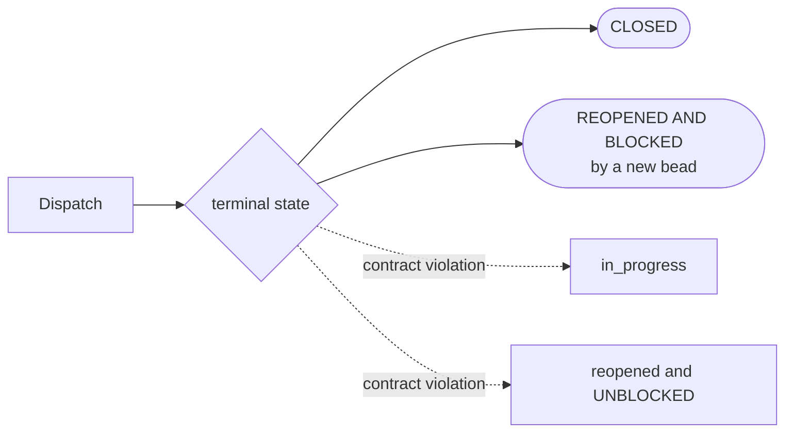

The two violation states are what strand a bead. `in_progress` looks like live work
to the foreman and gets recovered as a crash; reopened-unblocked re-enters the ready
queue immediately and re-dispatches the same unfinished work forever.

---

## 6. Recovery path

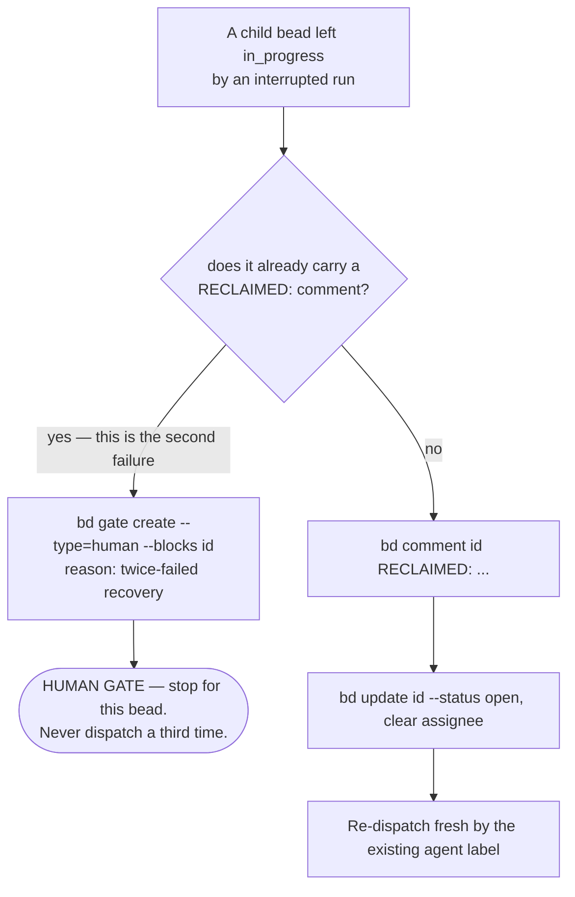

Recovery adds **no routing logic**. The `agent` label still decides the handler. A
worker picking up a bead marked `RECLAIMED:` first checks whether the work is already
complete — and if so, just closes it.

---

## 7. The builder's flow

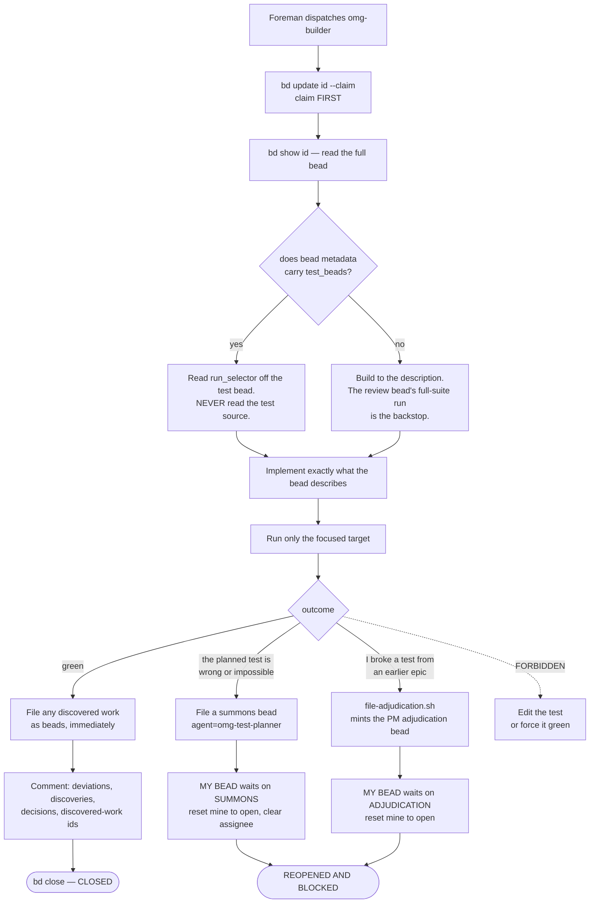

The two escape hatches are the whole point of this diagram. A builder that cannot
make a test pass has exactly two legitimate moves — summon the confidence planner, or
file for PM adjudication — and one forbidden one.

---

## 8. The tester's flow

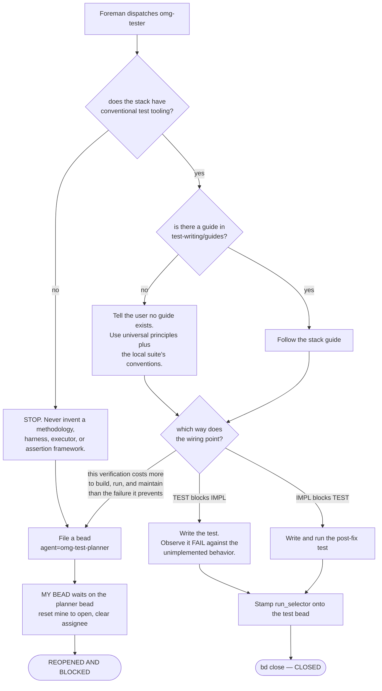

The tester is the **sole test author** in the workflow. Builders write no tests; the
confidence planner mints them and the foreman dispatches them here.

---

## 9. Summons resolution — `summons-stuck-builder`

One summons file serves two escalators, and almost every branch resolves differently
depending on which one it was. That polymorphism is the reason this path is worth its
own diagram.

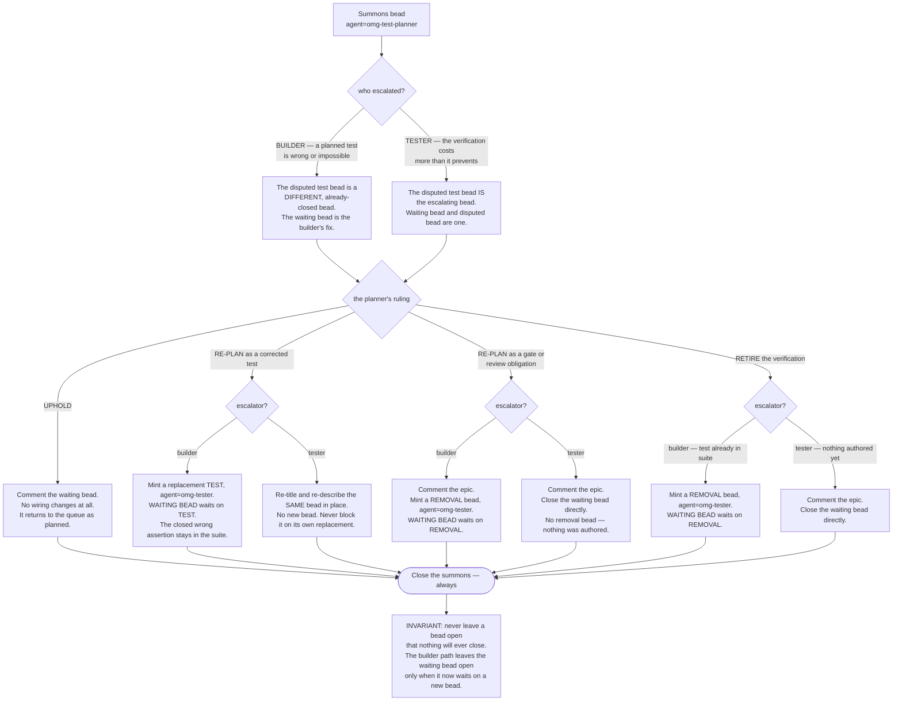

Why the builder and tester branches diverge so sharply: for a **builder**, the
waiting bead is a fix that legitimately stays open and waits. For a **tester**, the
waiting bead is the very thing being ruled on. Same variable, opposite roles — which
is exactly the ambiguity that produced two epic-wedging bugs before the placeholders
were split apart.

---

## 10. Review, findings, and the fix loop

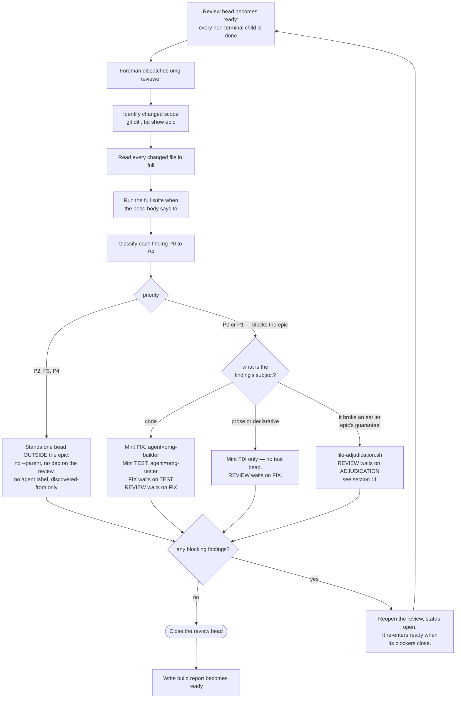

### The priority scale

| P | Definition | Blocks? |
|---|---|---|
| P0 | Security vulnerability, data-loss risk, crash in the happy path | Yes |
| P1 | Correctness bug in what this epic promises, or a failure whose recovery costs more than the fix | Yes |
| P2 | Performance, missing important tests, poor naming | No |
| P3 | Style, minor refactor, docs gaps | No |
| P4 | Nits, suggestions, nice-to-haves | No |

### Regression by default

For a blocking finding whose subject is **code**, the regression test is minted
alongside the fix at filing time and authored **before** it — so it is observed
failing against the reproducible defect, which is the only evidence a regression test
catches anything. No separate verification-planning dispatch is spent deciding
whether to test it: setting the finding to P0/P1 *was* the blast-radius judgment, and
re-deciding it from less context is the loop's principal amplifier.

For prose or a declarative artifact, no test bead is minted at all — the
review-and-fix cycle is itself the verification.

### The report and epic close

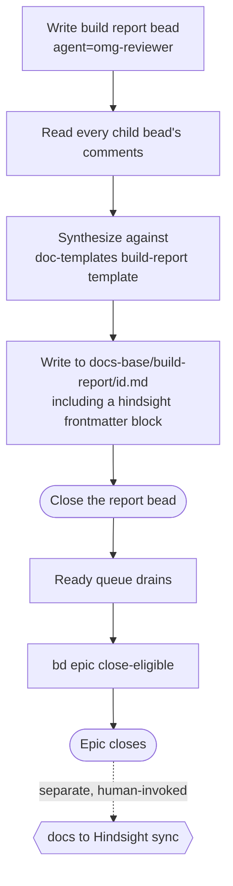

The report bead does **not** close the epic, and writing the report ships nothing.
The report contains: Summary, Deviations from Spec, Discovered Constraints, Decisions
Made During the Build, Discovered Work, Outcome.

---

## 11. Adjudication — when a change collides with a prior guarantee

The product manager owns the question "was that behavior still supposed to hold?" It
is a product judgment, not a build defect for someone else to patch around.

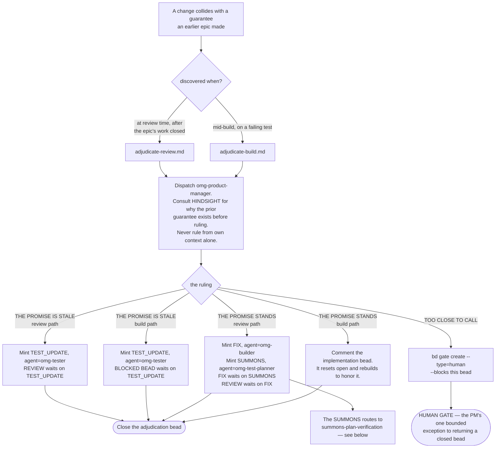

### The PM path keeps its planner summons — deliberately

Regression-by-default — section 10, *Review, findings, and the fix loop* —
applies to review findings and **not** here. The
asymmetry is the point: **default where the judgment is predictable, dispatch where it
is not.** A review finding is a confirmed defect in code this epic changed, and the
reviewer already did the blast-radius work. A broken-promise ruling is not that — the
"fix" might be restoring prior behavior, adjusting a boundary, or reconciling two
guarantees that now conflict, and there is often no reproducible defect to pin a
regression test to.

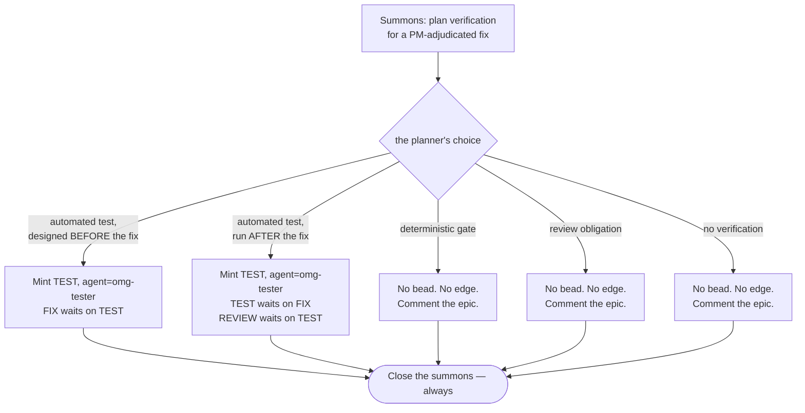

The before/after ordering distinction in the first two branches is load-bearing, and
the wiring differs completely between them. Note the direction flip: in the
before-case the fix waits on the test; in the after-case the test waits on the fix and
the review waits on the test.

---

## 12. What these diagrams expose

Drawing the whole thing makes two gaps visible that are hard to see while reading any
single instrument. Both are recorded here as observations, not as decisions.

**Two of the four verification outcomes are recorded and never discharged.**
Section 3, *The confidence planner's four outcomes*, traces
it: a deterministic gate and a review obligation each produce a comment on the epic
and nothing else. Nothing mints a bead for a gate, nothing checks at review that it
ran, nothing confirms it exists. The review bead runs "the full test suite," which
does not necessarily include a validator or a linter. The danger is not that they do
nothing — it is that they **claim** something. "Gate for X: `terraform validate`
catches it" reads as coverage. That is manufactured confidence, which is precisely
what the confidence planner exists to prevent.

Drawing section 4, *Canonical bead topology*, alongside section 10, *Review,
findings, and the fix loop*, sharpens it further: those decisions are recorded as comments
**on the epic**, and the report-writer bead reads "every *child* bead's comments." The
epic is not its own child. So a gate or review obligation chosen at plan time is read
once — by the decomposer's own re-review pass — and then by nothing else, ever. It
does not reach the build report either.

**Nothing bounds the review-fix cycle.** The loop in section 10, *Review,
findings, and the fix loop* — review finds a blocking finding,
mints a fix, reopens itself, runs again — has no termination condition other than a
review pass that finds nothing. The decomposer's re-review loop in section 2,
*Plan phase*, has the same shape.
Fix-round convergence is specified in the PRD and is not built.

---

## Related documents

- `docs/prd/prd.platform.verification-economy.0001.md` — the product case for the
  four-outcome vocabulary and the proportionality judgment
- `docs/spec/spec.platform.verification-economy.0001.md` — the build contract for the
  thirteen instrument changes those outcomes required
- `docs/prd/prd.platform.test-planning.0002.md` — verification ownership, phasing, the
  dispatch lifecycle contract, and crash recovery
